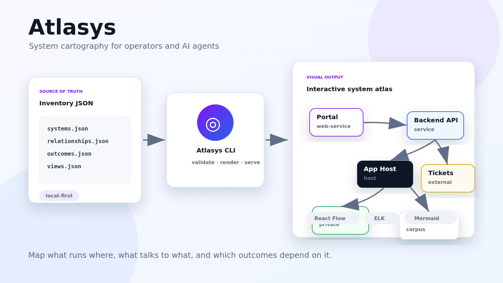
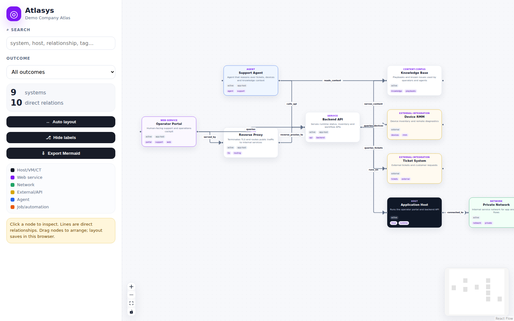

# Atlasys

**Atlasys** is an open-source system cartography toolkit for operators and AI agents.

It turns infrastructure knowledge into a portable atlas: systems, services, networks, integrations, operational outcomes and direct relationships. The inventory stays as plain JSON, the CLI validates and renders it, and the visual viewer makes it explorable with React Flow and ELK layout.

Atlasys is built by [wizhelp](https://wizhelp.me) for teams that want infrastructure maps agents can actually reason over, without leaking private topology into a SaaS product.



## Preview



The preview uses the sanitized demo project included in this repository. It does not contain private infrastructure data.

## What Atlasys is

Atlasys is:

- a CLI for creating, validating, rendering and serving system maps
- a schema-light inventory format based on JSON files
- an agent guide (`AGENT.md`) for safe read-only discovery
- a Mermaid exporter for versioned docs
- a React Flow + ELK viewer for professional visual exploration

Atlasys is not:

- a live scanner that mutates infrastructure
- a monitoring system
- a secrets store
- a hosted SaaS
- a replacement for source-controlled documentation

## Why it exists

Operational knowledge usually ends up scattered across tickets, dashboards, READMEs, runbooks, scripts, memories and people's heads.

That is painful for humans and risky for agents. If an agent does not understand what talks to what, where a service runs, or which outcome depends on which system, it cannot operate safely.

Atlasys gives agents and developers a grounded structure:

- source-of-truth inventory files
- direct system relationships
- outcome-oriented mapping
- repeatable validation and rendering
- local-first privacy boundaries
- human-readable generated docs
- visual maps that can be inspected and adjusted

## Features

- `atlasys init` project scaffold
- `atlasys validate` inventory checks
- `atlasys render` Mermaid diagrams and viewer data
- `atlasys serve` local static viewer
- `atlas` command alias for convenience
- React Flow + ELK auto-layout
- draggable cards with browser-local layout persistence
- direct relationship arrows and labels
- node detail panel with inbound/outbound relations
- outcome filters and search
- Mermaid export from the current view
- portable `AGENT.md` guide for agents
- read-only-first mapping philosophy

## Quick start

From GitHub:

```bash
git clone https://github.com/wizhelp-net/Atlasys.git
cd Atlasys
npm install
npm run build
node bin/atlas.mjs serve --project examples/demo
```

Install globally from a clone:

```bash
npm install -g .
atlasys init my-map
cd my-map
atlasys validate --project .
atlasys render --project .
atlasys serve --project .
```

Once published to npm:

```bash
npm install -g atlasys
atlasys init my-map
cd my-map
atlasys render --project .
atlasys serve --project .
```

## Demo

The repository includes a sanitized demo under `examples/demo`.

```bash
npm install
npm run build
node bin/atlas.mjs serve --project examples/demo
```

Then open:

```text
http://127.0.0.1:8787
```

## Project structure

A map project contains:

```text
atlas.json
AGENT.md
inventory/
  systems.json
  relationships.json
  outcomes.json
  views.json
layouts/
  main.json
generated/
```

Inventory files are the source of truth. Generated files can be deleted and recreated.

## Inventory model

Atlasys uses three main concepts.

### Systems

Systems are the things that participate in operations:

- hosts
- VMs and containers
- services
- web applications
- networks
- APIs
- scheduled jobs
- agents
- content corpora
- data stores
- external integrations

Example:

```json
{
  "id": "backend-api",
  "name": "Backend API",
  "type": "service",
  "host": "app-host",
  "bind": "127.0.0.1:8080",
  "role": "Serves runtime status, inventory and workflow APIs",
  "status": "active",
  "tags": ["api", "backend"]
}
```

### Relationships

Relationships are direct edges between systems. They are the most important part of the map.

Example:

```json
{
  "from": "operator-portal",
  "to": "backend-api",
  "label": "queries"
}
```

Prefer precise labels such as:

- `runs_on`
- `served_by`
- `reverse_proxies_to`
- `queries`
- `calls_api`
- `reads_from`
- `writes_to`
- `triggers`
- `publishes_to`
- `monitors`
- `protects`

Avoid vague edges like `related_to` unless there is no better label.

### Outcomes

Outcomes describe operational capabilities and the systems that support them.

Example:

```json
{
  "id": "support-operations",
  "name": "Support operations",
  "description": "Operators inspect requests, devices and knowledge from one cockpit.",
  "systems": ["operator-portal", "backend-api", "ticket-system"]
}
```

## CLI reference

```bash
atlasys init <dir>
atlasys validate --project <dir>
atlasys render --project <dir>
atlasys serve --project <dir> [--port 8787]
```

`atlas` is also available as an alias:

```bash
atlas render --project examples/demo
```

## Privacy model

Atlasys does not include anyone's infrastructure atlas.

The public repository contains:

- generic CLI code
- generic viewer code
- templates
- documentation
- a sanitized demo project

Your generated atlas is created locally in your own project directory. Do not publish generated inventories if they contain private topology, URLs, hostnames, paths, risks or operational relationships.

The npm package intentionally excludes example projects and generated inventories.

## Agent usage

Read `AGENT.md` before mapping an environment. It explains how an agent should discover systems safely, avoid secrets, and improve sparse maps by adding direct relationships.

A good agent workflow is:

1. identify outcomes
2. list systems
3. add direct relationships
4. validate
5. render
6. visually inspect missing lines
7. iterate

## Development

```bash
npm install
npm run build
npm run check
node bin/atlas.mjs serve --project examples/demo
```

## Release status

Atlasys is early but usable. The current release focuses on manual/agent-assisted cartography, validation, Mermaid export and local visual exploration.

Planned next steps:

- read-only scanner suggestions for common platforms
- layout export/import
- SVG/PNG export
- diff and drift reports
- richer risk and blast-radius views

## Contributing

See [`CONTRIBUTING.md`](CONTRIBUTING.md).

## Security

See [`SECURITY.md`](SECURITY.md). Please do not include private infrastructure data, secrets or raw logs in issues.

## License

MIT
